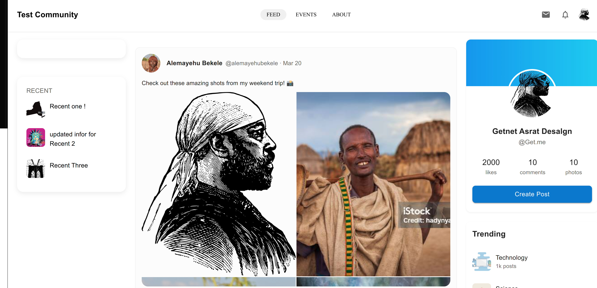

# Community Page Application



## Overview

A sleek, responsive community platform built with React and TypeScript, enabling users to publish posts, participate in layered discussions through nested comments, and engage with community content through likes and replies.

## Features

Modern UI with Material-UI components
Fully responsive design
Create and view posts with rich text formatting
Support for multiple image uploads
Nested comment system with infinite reply depth

## Technology Stack

- React
- TypeScript
- Material-UI
- SCSS Modules
- Emotion (for styled components)

## Project Structure

```tree
src/
├── components/
│   ├── Comment.tsx           # Handles individual comments and nested replies
│   ├── CreateComment.tsx     # Comment creation form component
│   ├── CreatePost.tsx        # Post creation dialog component
│   ├── Post.tsx             # Individual post display component
│   ├── PostList.tsx         # Renders list of posts
│   └── Navbar.tsx           # Application navigation bar
├── layout/
│   └── Layout.tsx           # Main layout wrapper component
├── types/
│   └── index.ts             # TypeScript type definitions
└── data/
    └── mockData.ts          # Mock data for development
```

## Core Components 🧩

### CommunityPage

- Main container component
- Manages posts state
- Handles post creation
- Integrates with Layout component

### Post Component

- Displays individual posts
- Manages comments and replies
- Supports multiple image layouts

### Comment System

- Implements nested replies
- Like/dislike functionality
- Real-time comment updates
- Infinite nesting capability

## Getting Started 🚀

1. Clone the repository:

```bash
git clone https://github.com/GetnetAdugna/TestTask.git
```

2. Install dependencies:

```bash
cd  <project-name>
npm install
```

3. Start the development server:

```bash
npm run dev
```

## Component Architecture 🏗️

```
Layout
└── CommunityPage
    ├── CreatePost
    └── PostList
        └── Post
            └── Comment
                └── CreateComment
```

## State Management 🔄

- Local state management using React hooks
- Prop drilling for component communication
- Recursive state updates for nested comments

## Styling Approach 🎨

- Material-UI's styled components for base components
- SCSS modules for component-specific styling
- Responsive design using Material-UI's theme breakpoints
- Consistent color palette and typography

## Key Features Implementation 🔑

### Post Creation

- Rich text editor
- Image upload support
- Real-time preview
- Form validation

### Comment System

- Nested replies
- Like/dislike functionality
- Real-time updates
- Infinite nesting
